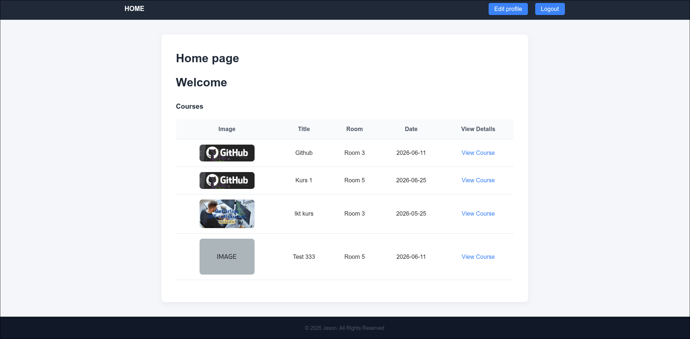
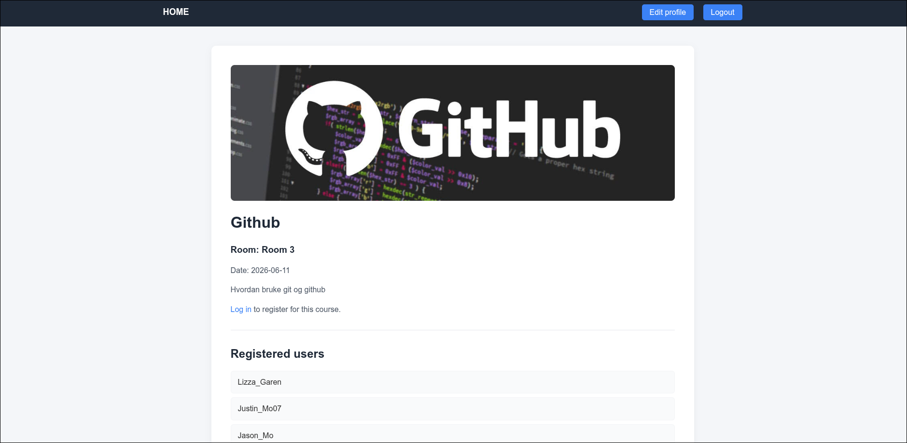

# Førebuing til eksamen – eksempelnettside

Dette er ei enkel eksempelnettside laga som førebuing til eksamen.  
Prosjektet viser grunnleggande PHP-utvikling med database, brukarhandtering og kursadministrasjon.

## Funksjonar

- Registrering av brukar
- Innlogging
- Opprette kurs
- Vise kurs
- Redigere kurs
- Redigere brukar

## Teknologi

Prosjektet er laga med:

- PHP
- MySQL
- HTML/CSS

## Skjermbilete

### Heimside

### Kursoversikt

## Mål med prosjektet

Målet med prosjektet var å øve på:

- CRUD-operasjonar
- PHP og MySQL
- brukarautentisering
- strukturering av nettsider
- enkel frontend-design
